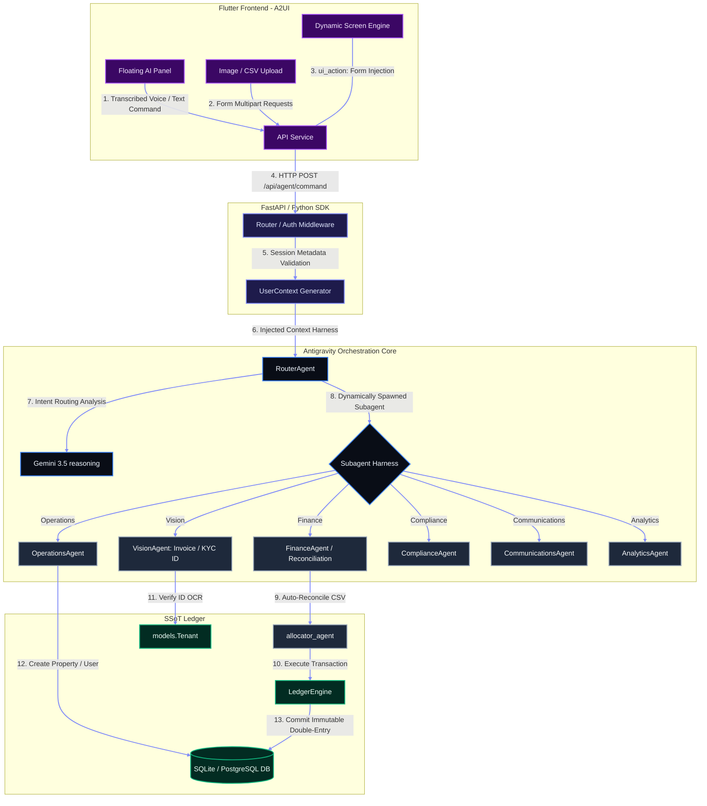
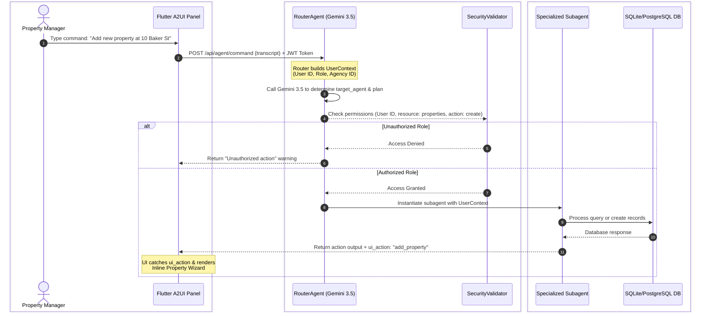
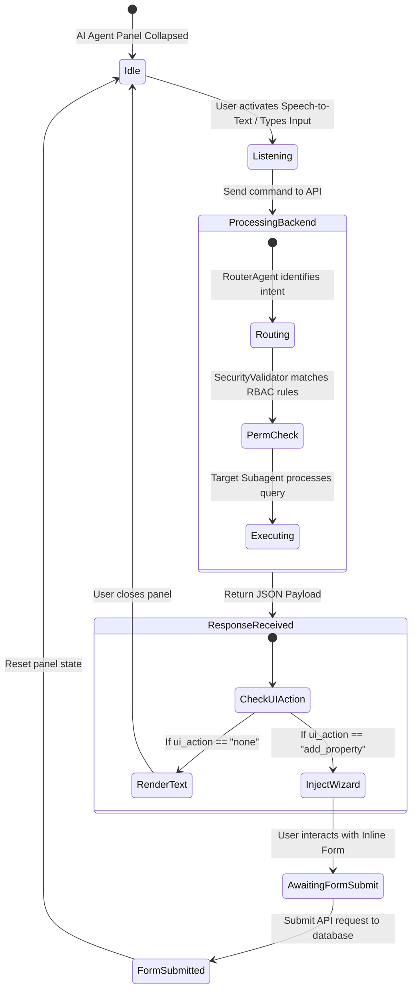
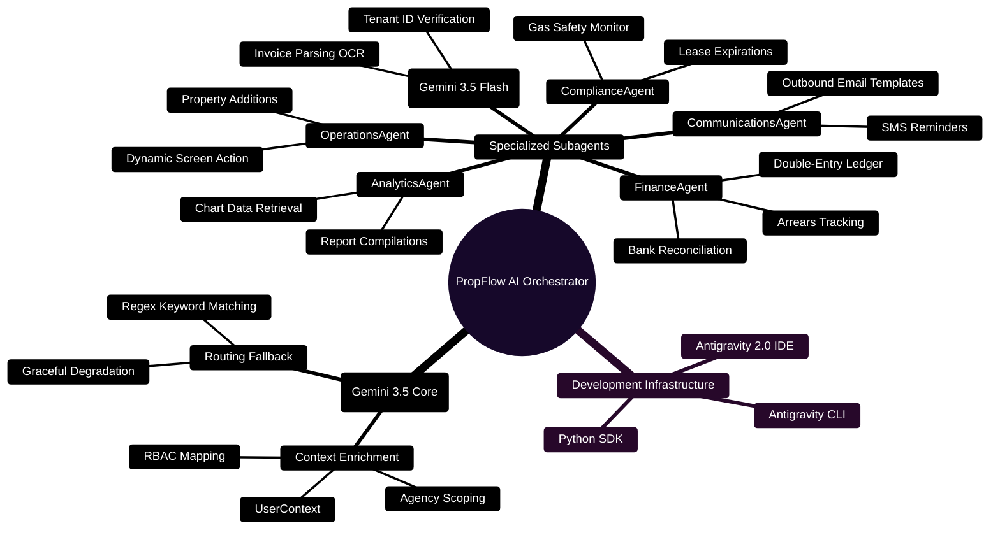

# PropFlow AI: Autonomous Property Management & CRM Platform
### 🏆 Powered by Google Antigravity 2.0 IDE, Antigravity CLI, and Gemini 3.5
---

**PropFlow AI** is an enterprise-grade autonomous property management and CRM platform that automates the rent collection, lease administration, KYC compliance, and contractor payout lifecycles. Built during the **Agentic Architect Sprint**, the project showcases how **Gemini 3.5 Reasoning**, **Dynamic Parallel Subagents**, and the **Antigravity 2.0 Shared Harness** orchestrate complex, role-restricted business workflows while reducing time-to-value through an interactive **Agentic UI (A2UI)**.

This solution is aligned with the following Sprint requirements:
*   **Sprint Category:** Core Architecture & Multi-Agent Orchestration
*   **Selected Topic:** Dynamic Subagents & Shared Agent Harness
*   **Development Tools:** Antigravity 2.0 (IDE/Desktop Command Center), Antigravity CLI, and the Python SDK.

---

## 📸 Media & Interface Showcases
> [!NOTE]
> *Insert your video recording link and platform screenshots in the placeholders below before submitting your report to the judges.*

*   **Project Demonstration Video:** [Watch the Video Walkthrough](https://link-to-your-video.com)
*   **Core UI Dashboard:** 
    

---

## 🗺️ Architectural Diagrams & Mindmaps

To illustrate the orchestration under the hood, here are the architectural blueprints of PropFlow AI.

### 1. Unified Component & Infrastructure Architecture
This diagram outlines the flow of data from the Flutter A2UI frontend, through the FastAPI gateway, into the Antigravity-orchestrated agents, and down to the immutable Ledger Database.



---

### 2. Multi-Agent Orchestration & Decision Flow
This sequence shows how the system processes a conversational request by utilizing routing logic before running operations.



---

### 3. Agentic UI (A2UI) State Machine
This state machine demonstrates how the client-side UI modifies its state reactively based on agent execution outputs.



---

### 4. Multi-Agent System Mindmap
This mindmap shows the relationship between different subagents, their specialized tools, and the Antigravity harness.



---

## 🛠️ The Business Problem & Use Cases

Property management is traditionally slow, paperwork-heavy, and error-prone. PropFlow AI automates these operations:
1.  **Bank Statement Reconciliation:** The `ReconciliationAgent` processes bank CSV files and reconciles entries with the database using Gemini 3.5's reasoning capabilities, calculating confidence intervals.
2.  **Expense Scanning (OCR):** Property managers can upload contractor invoices. The system runs them through Gemini 3.5 Flash's vision engine to extract details, automatically creating expense entries in the ledger.
3.  **KYC Tenant ID Verification:** Tenant identity documents (passports, driver's licenses) are checked against tenant database records using multi-modal AI, flagging mismatches or compliance warnings.
4.  **Immutability (Triple Ledger Model):** Records payments across Tenant, Landlord, and Agency ledgers to prevent accounting discrepancies.

---

## 🏗️ Technical Deep Dive

### 1. Unified Agent Core & Shared Harness
Every call to the API is protected by the **Shared Agent Harness** pattern. In [router.py](file:///C:/Users/mrmoh/Desktop/propflow/backend/app/agents/router.py), a structured `UserContext` is created:

```python
class UserContext(BaseModel):
    user_id: int
    name: str
    role: str
    agency_id: int
```

This context is injected into the agent execution flow. Instead of exposing the entire database structure, the harness acts as an isolation boundary, only exposing resources matching the user's `agency_id` and role permissions, avoiding flat-prompt context saturation.

### 2. Role-Based Agent Guardrails
The [SecurityValidator](file:///C:/Users/mrmoh/Desktop/propflow/backend/app/agents/security_validator.py) checks permissions dynamically:

```python
class SecurityValidator:
    @staticmethod
    def check_permission(db: Session, user_id: int, resource: str, action: str) -> bool:
        permission = db.query(UserPermission).filter(
            UserPermission.user_id == user_id,
            UserPermission.resource == resource,
            UserPermission.action == action
        ).first()
        return permission is not None
```

If a user tries to execute an action without the required privileges, the subagent halts execution before database modification occurs.

### 3. Agentic UI Form Injection (A2UI)
In [dashboard_screen.dart](file:///C:/Users/mrmoh/Desktop/propflow/frontend/lib/screens/dashboard_screen.dart), when the API responds with `ui_action: "add_property"`, the Flutter frontend dynamically replaces the text chat container with a functional widget (`_buildInlineAddPropertyWizard()`):

```dart
child: _aiUiAction == 'add_property'
    ? _buildInlineAddPropertyWizard()
    : Text(_aiAgentResponse)
```

This dynamic form injection streamlines structured workflows, allowing users to enter data without leaving the agent overlay.

---

## 🚀 Installation & Setup Guide

This guide describes how to set up the project locally using **Antigravity CLI** and run the components.

### 📋 Prerequisites
*   **Python 3.10+**
*   **Flutter SDK 3.22+**
*   **Gemini API Key** (Obtain from [Google AI Studio](https://aistudio.google.com/))

---

### 1. Backend Setup (FastAPI & SQLite)

1.  **Open your terminal** (or use the Antigravity CLI terminal interface).
2.  Navigate to the backend directory:
    ```powershell
    cd backend
    ```
3.  Create and activate a virtual environment:
    ```powershell
    python -m venv venv
    .\venv\Scripts\Activate.ps1
    ```
4.  Install dependencies:
    ```powershell
    pip install -r requirements.txt
    ```
5.  Set up your environment variables by copying the example file:
    ```powershell
    copy .env.example .env
    ```
6.  Edit your `.env` file to include your Gemini API key:
    ```env
    DATABASE_URL=sqlite:///./rentcollections.db
    GEMINI_API_KEY=your_gemini_api_key_here
    ```
7.  Initialize the database schemas and seed initial data using the CLI scripts:
    ```powershell
    python create_tables.py
    python migrate_db.py
    ```
8.  Start the FastAPI server:
    ```powershell
    uvicorn app.main:app --reload --port 8000
    ```

---

### 2. Frontend Setup (Flutter Web/Desktop)

1.  Open a new terminal window and navigate to the frontend directory:
    ```powershell
    cd frontend
    ```
2.  Install dependencies:
    ```powershell
    flutter pub get
    ```
3.  Run the Flutter app locally in your browser:
    ```powershell
    flutter run -d chrome --web-renderer canvaskit
    ```

---

## 🛠️ Development with Antigravity 2.0 IDE & CLI

PropFlow AI was developed and tested using **Antigravity 2.0 Developer Tools**:
*   **Antigravity 2.0 IDE:** Used to monitor parallel subagent routing decisions, review database logs, inspect the state of local variables during execution, and inspect files.
*   **Antigravity CLI:** Used to execute database migrations (`migrate_db.py`), run testing scripts, and check API schemas.
*   **Python SDK:** Used to manage thread execution pools, schedule cron tasks, and parse multi-modal image inputs from the UI.
