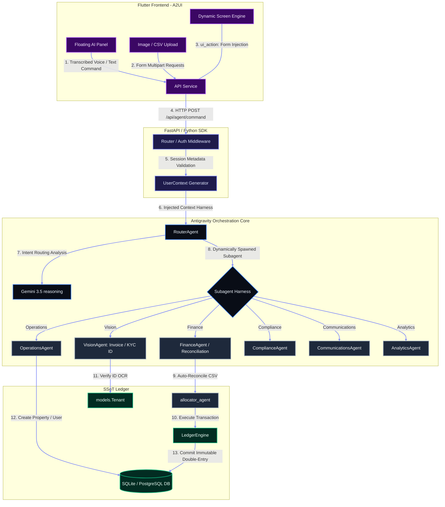
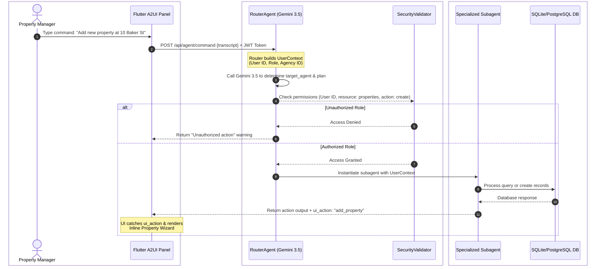
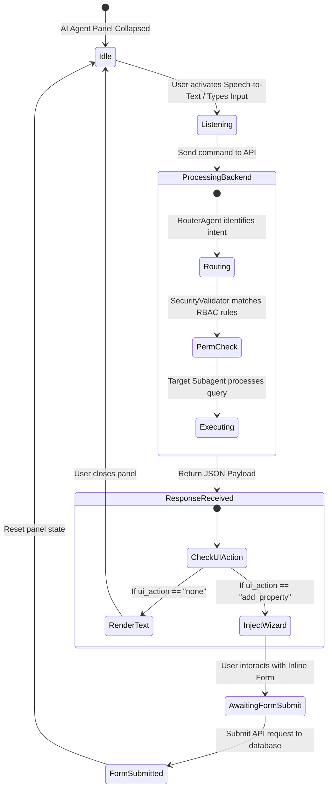

# Building PropFlow AI: Architecting a Multi-Agent Property Automation Engine with Gemini 3.5 & Flutter A2UI
### 🚀 A deep technical dive into tree-based orchestration, context-aware routing, and interactive Agentic UIs using Antigravity 2.0 IDE and CLI

## Introduction
Modern business software is undergoing a generational shift. For decades, developers built SaaS platforms with rigid relational database schemas, complex forms, and deterministic backend logic. While this structure is perfect for keeping accurate ledgers, it forces human users to act as "data entry routers"—manually reviewing emails, copy-pasting numbers from PDFs, and reconciling bank statements row-by-row.

With the release of **Gemini 3.5**, we now have the reasoning capacity and multi-modal speeds necessary to automate these manual flows. However, dumping the entire database context and operational guidelines into a single, flat system prompt causes **context saturation**, slowing down latency, increasing token costs, and introducing unpredictability. 

In this architectural deep dive, we'll look under the hood of **PropFlow AI**—an autonomous property management platform—to see how it uses a **Unified Agent Core**, **Dynamic Subagents**, a **Shared Agent Harness**, and **Agentic UI (A2UI)**, all built and orchestrated using the **Antigravity 2.0 IDE**, **Antigravity CLI**, and the **Python SDK**.

---

## 1. Architectural System Overview

PropFlow AI separates conversational orchestration, transaction processing, and user interface rendering into decoupled, message-driven layers:



---

## 2. The Architectural Shift: Tree-Based Routing vs. Flat Prompts
In a basic AI app, you might have one chatbot prompt that knows about properties, invoices, tenant compliance, and emails. In an enterprise system, this leads to chaos. The model confuses different domain rules, hallucinates permissions, and spends valuable context window space on unrelated instructions.

PropFlow AI solves this by introducing a **Tree-Based Routing Pattern**:



The orchestrator, [RouterAgent](file:///C:/Users/mrmoh/Desktop/propflow/backend/app/agents/router.py), uses the reasoning power of `gemini-3.5` to analyze the intent of the prompt and output a structured JSON plan:

```json
{
  "target_agent": "finance_agent",
  "reasoning": "User requested an update on tenant arrears and late payouts.",
  "action_plan": "Fetch the pending payouts list and filter by outstanding status.",
  "ui_action": "none"
}
```

By decoupling the router from the subagents, each subagent remains lightweight, specialized, and highly accurate. If the API fails or is throttled, the router has a regex-based **graceful degradation** fallback, ensuring the core platform remains operational.

---

## 3. Enforcing Governance: The Shared Agent Harness
Spawning subagents dynamically raises a critical security question: **How do you keep child agents from executing actions they shouldn't?** 

PropFlow AI solves this with a **Shared Agent Harness** powered by a structured `UserContext` and RBAC (Role-Based Access Control) validator:

```python
class UserContext(BaseModel):
    user_id: int
    name: str
    role: str # administrator, support_agent, accountant, landlord
    agency_id: int
```

When a command arrives at `/api/agent/command`, the backend builds the context directly from the verified JWT session of the logged-in user. The `RouterAgent` injects this context into the system prompt:

```python
def build_system_prompt(self, context: UserContext) -> str:
    return (
        f"You are the main coordinator for Rent Collections A2UI. "
        f"You are assisting {context.name} (Role: '{context.role}'). "
        f"Remember they only have access to actions permitted by their role."
    )
```

Furthermore, before any state-modifying action is committed, the [SecurityValidator](file:///C:/Users/mrmoh/Desktop/propflow/backend/app/agents/security_validator.py) checks the `UserPermission` table:

```python
class SecurityValidator:
    @staticmethod
    def check_permission(db: Session, user_id: int, resource: str, action: str) -> bool:
        permission = db.query(UserPermission).filter(
            UserPermission.user_id == user_id,
            UserPermission.resource == resource,
            UserPermission.action == action
        ).first()
        return permission is not None
```

If a user with a `support_agent` role commands: *"Approve landlord cash advance of £5,000"*, the subagent fails open-safely, logging a security warning and returning a permission denial message.

---

## 4. Deep Dive: Specialized Subagents in Action

### A. Autonomous Bank Reconciliation (`ReconciliationAgent`)
Manually reconciling bank statements is a major time sink. The [ReconciliationAgent](file:///C:/Users/mrmoh/Desktop/propflow/backend/app/agents/allocator.py) automates this.
1.  The backend pulls active tenancies for the agency (capped at 50 to avoid prompt bloat).
2.  It sends the active tenancies database list alongside the uploaded bank statement CSV to `gemini-3.5` reasoning model.
3.  The agent matches references, names, and partial amounts, returning a structured report:

```json
{
  "allocated": [
    {
      "transaction_date": "2026-07-01",
      "bank_reference": "K. SMITH RENT",
      "amount": 1200.0,
      "matched_tenancy_id": 8,
      "confidence": "high",
      "reasoning": "Reference name matches tenant Kevin Smith and amount matches expected rent."
    }
  ],
  "unallocated_requires_human": []
}
```

### B. Multi-Modal Vision KYC Check
Compliance requires verifying a tenant's Proof of ID. The vision subagent receives raw bytes of a passport or driver's license from the frontend and uses the multi-modal engine of `gemini-3.5` to extract details and perform a structured comparison against database values:

```python
prompt = f"""
Verify this Proof of ID (Passport, Driving License, or ID Card).
Compare the text with these EXPECTED details:
Name: {expected_name}
Current Address: {expected_address}
"""
```

The model returns a JSON schema containing `verified: true/false`, the `document_type` detected, and its reasoning.

---

## 5. Closing the Loop: Agentic UI (A2UI) in Flutter
Traditional chatbots return text. Text is useful for questions, but terrible for workflow setup. If the agent says, *"I need you to add a new property. What is the address?"*, typing back-and-forth is slow.

PropFlow AI solves this by introducing **Agentic UI (A2UI)**. The agent can command the UI to render structured forms in-context.



1.  The user says: *"I want to add a property."*
2.  The backend `RouterAgent` detects the intent and returns:
    ```json
    { "ui_action": "add_property" }
    ```
3.  The Flutter dashboard screen intercept the payload and updates the UI state:
    ```dart
    _aiUiAction = result['ui_action'] ?? 'none';
    ```
4.  The response container switches dynamically:
    ```dart
    child: _aiUiAction == 'add_property'
        ? _buildInlineAddPropertyWizard()
        : Text(_aiAgentResponse)
    ```
5.  Instead of a chat bubble, the user is presented with a structured property creation wizard inline. When they submit, the form updates the database, and the assistant panel returns to normal chat mode.

---

## 6. Development with Antigravity 2.0 IDE & CLI

The development of PropFlow AI relied heavily on the **Antigravity 2.0 Suite**:
*   **Antigravity 2.0 IDE:** Provided a visual timeline to trace multi-agent execution paths, inspect SQLite session scopes, and hot-reload Python code changes live.
*   **Antigravity CLI:** Enabled running test cases and executing database migrations (`python migrate_db.py`) directly from the terminal without manual configuration.
*   **Python SDK:** Integrates core scheduling services (`APScheduler`) to automate daily overdue reminders and background email synchronization cycles concurrently.

---

## Conclusion & Key Takeaways
By isolating tasks into specialized subagents, binding them to a shared context harness, and closing the loop with interactive UI injection, PropFlow AI shows how to build real-world AI applications. 

### Key Engineering Rules for Multi-Agent Apps:
1.  **Keep Prompts Single-Purpose:** Let one router choose the tool, and let dedicated subagents run them.
2.  **Enforce RBAC Early:** Never trust an LLM to police its own actions. Enforce user permissions at the database level.
3.  **UI is Part of the Agent:** Stop building simple chatbots. Let your agents control the screen to give users the best tool for the job.
